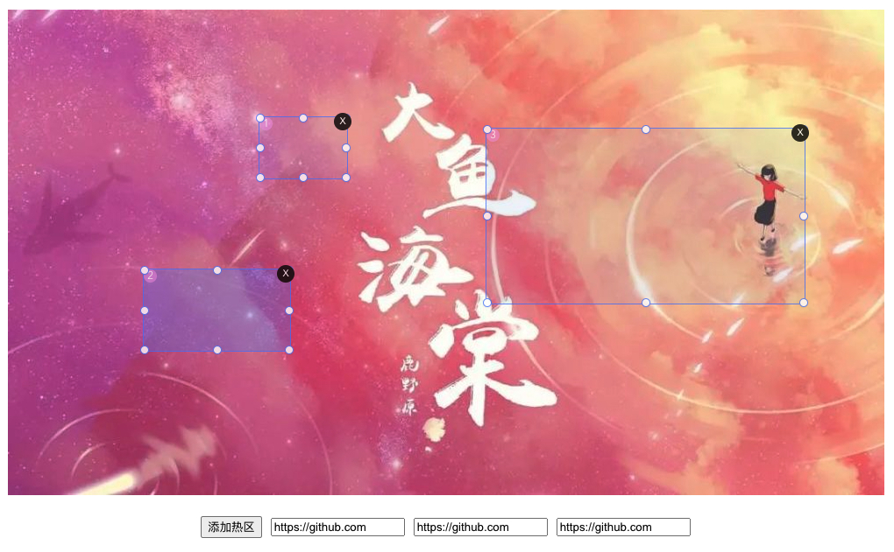

# hotspot-vue3 · [](https://www.npmjs.com/package/hotspot-vue3) [](https://yarnpkg.com/package/hotspot-vue3) [](https://github.com/shadow-Fiend/hotspot-vue3) [](https://github.com/shadow-Fiend/hotspot-vue3/issues) [](https://github.com/shadow-Fiend/hotspot-vue3/network/members) [](https://github.com/shadow-Fiend/hotspot-vue3/stargazers)

A hot zone generation tool for VUE3 + TS projects [中文文档](./README_ZH.md)



[Try out the demo!](https://shadow-fiend.github.io/hotspot-vue3/)

## Plug-in installation

```bash
yarn add hotspot-vue3

# or

npm install hotspot-vue3 --save
```

## The plug-in USES

- Introduced in the business component file

```javascript
import Hotspot from "hotspot-vue3";
```

- In your business code, use it as a normal component

```vue
<template>
  <div class="hotapp">
    <hotspot
      :image="image"
      :zonesInit="zones"
      :types="types"
      :minSize="52"
      :switchOptions="{
        isShowSign: true,
        isShowDelete: true,
        isOverlap: false,
        isShowActive: true
      }"
      :styleOptions="{}"
      @add="handleAdd"
    >
      <!-- <template #sign="{ zone, index }">
        {{ zone }}
        {{ index }}
      </template>
      <template #delete="{ index }">
        {{ index }}
      </template> -->
    </hotspot>
    <div class="hotapp__display">
      <button type="primary" @click="handleAdd">Add hot spots</button>
      <input
        type="text"
        v-for="(zone, index) in zones"
        :key="index"
        v-model="zone.url"
        :placeholder="`Area ${index + 1} url`"
      />
    </div>
  </div>
</template>

<script lang="ts">
import { Options, Vue } from "vue-class-component";
import Hotspot from "hotspot-vue3";

type MoreUrl = {
  [key in string | number]: string;
};
interface ZoneType {
  topPer: number;
  leftPer: number;
  widthPer: number;
  heightPer: number;
  url?: string | MoreUrl;
  active?: boolean;
  key?: string;
}

@Options({
  components: {
    Hotspot
  }
})
export default class App extends Vue {
  // image url
  image =
    "https://github.com/shadow-Fiend/readme_image/blob/master/big_fish.jpeg";
  zones = [] as ZoneType[];
  types = "move";

  handleAdd(zon: ZoneType) {
    let zone: ZoneType;
    if (zon.topPer) {
      // If this parameter exists, drag to create a hot zone
      zone = zon;
      zone.url = "https://github.com";
      this.types = "move"; // When Max hot zones exist, verify by dragging or clicking to Max
    } else {
      // Create hot zones with buttons
      zone = {
        heightPer: 0.2027, //20.27%
        leftPer: 0.2027,
        topPer: 0.2027,
        widthPer: 0.1027,
        url: "https://github.com",
        key: String(Math.random())
      } as ZoneType;
      this.types = "btn"; // When Max hot zones exist, verify by dragging or clicking to Max
    }
    this.zones.push(zone); // Hotspot data
  }
}
</script>

<style lang="scss" scoped>
.hotapp {
  font-family: Avenir, Helvetica, Arial, sans-serif;
  -webkit-font-smoothing: antialiased;
  -moz-osx-font-smoothing: grayscale;
  text-align: center;
  color: #2c3e50;
  margin-top: 60px;
  display: flex;
  flex-direction: column;
  align-items: center;
  min-height: 555px;
  min-width: 1000px;

  &__display {
    margin-top: 24px;

    > input {
      margin-left: 10px;
    }
  }
}
</style>
```

### Parameters that

As shown in the sample code, import this component directly, and control all other functions through properties.

Here's what each property means:

#### Hotspot Attributes

| Attribute     | Description                                                                                                                     |  Type  |                               Accepted Values                                | Default |
| :------------ | :------------------------------------------------------------------------------------------------------------------------------ | :----: | :--------------------------------------------------------------------------: | :-----: |
| image         | Url address of heat base map                                                                                                    | String |                                                                              |         |
| zonesInit     | Hot zone content, in array form                                                                                                 | Array  |            topPer、leftPer、widthPer、heightPer、url、active、key            |         |
| max           | That is, the maximum number of displays in the current hot zone. If you do not set this parameter, it can be added indefinitely | Number |                                                                              |         |
| types         | The way to add hot areas                                                                                                        | String | move: Generated by dragging the mouse, btn: Generated by custom button click |         |
| switchOptions | Hot zone switch properties                                                                                                      | Object |              isShowSign、isShowDelete、isOverlap、isShowActive               |         |
| styleOptions  | Hot zones display some color value properties                                                                                   | Object |               zoneBorderColor、zoneBgColor、zoneActiveBgColor                |         |

#### ZonesInit Atributes

| Attribute | Description                                                                   |        Type         | Accepted Values |      Default      |
| :-------- | :---------------------------------------------------------------------------- | :-----------------: | :-------------: | :---------------: |
| topPer    | Distance from the top as a percentage of the total area                       |       Number        |                 |                   |
| leftPer   | Distance to the left as a percentage of the total area                        |       Number        |                 |                   |
| widthPer  | Percentage of hot zone width in total area                                    |       Number        |                 |                   |
| heightPer | Percentage of hot zone height to total area                                   |       Number        |                 |                   |
| url       | Hot area link address, you can define your own object to save more parameters |    String / any     |                 |                   |
| active    | Hot zone activation state                                                     | Boolean / undefined |                 | false / undefined |
| key       | Hot zone key, used for unique identification                                  |       String        |                 |   Math.random()   |

#### SwitchOptions Atributes

| Attribute    | Description                                                 |  Type   | Accepted Values | Default |
| :----------- | :---------------------------------------------------------- | :-----: | :-------------: | :-----: |
| isShowSign   | Whether to display hot zone signs                           | Boolean |                 |  true   |
| isShowDelete | Whether to display the hot zone deletion sign               | Boolean |                 |  true   |
| isOverlap    | Whether coverage is allowed between hot zones               | Boolean |                 |  false  |
| isShowActive | Click the hot zone to see if the active status is displayed | Boolean |                 |  true   |

#### StyleOptions Atributes

| Attribute         | Description                                                                                       |  Type  | Accepted Values |         Default         |
| :---------------- | :------------------------------------------------------------------------------------------------ | :----: | :-------------: | :---------------------: |
| zoneBorderColor   | Hot zone border color                                                                             | String |                 |         #507bfb         |
| zoneBgColor       | Hot area background color                                                                         | String |                 | rgba(80, 123, 251, 0.1) |
| zoneActiveBgColor | Hot zone background color in active state. This color takes effect only when isShowActive is true | String |                 | rgba(80, 123, 251, 0.4) |

## Write in the last

At this point, all the ways to use the plug-in are covered.

This plugin only supports vue3.x projects...

For more information about the source of the plugin, please visit the GitHub plugin repository：[hotspot-vue3](https://github.com/shadow-Fiend/hotspot-vue3)
